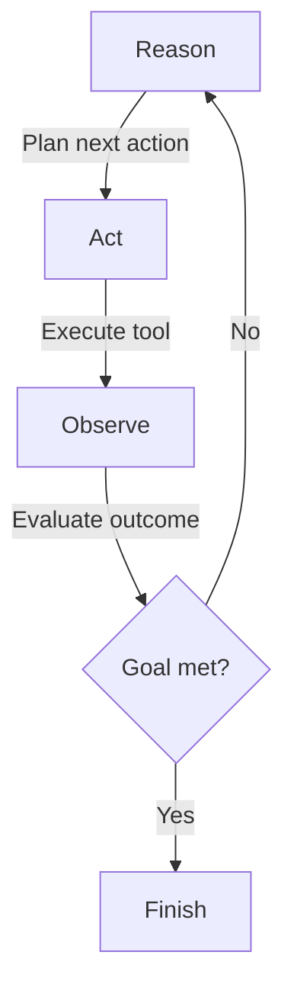

# CodeForge-AI — Agents Without Frameworks

> Everyone uses frameworks, but I wanted to understand the core logic.

CodeForge-AI is my bare-metal exploration of what it takes to build an autonomous coding agent **without** leaning on LangChain, LangGraph, or any orchestration framework. It is pure Python wrapped around OpenAI's API and the ReAct (Reason + Act) pattern, so you can see—step by step—how the planning loop works.

🔗 Check out the raw logic here: [CodeForge-AI](https://github.com/ayusingh-54/CodeForge-AI)

---

## Why This Exists

- **Future-proof skills**: Building agents will be the next baseline ability for software engineers.
- **No glue code**: Every interaction with the model is handwritten; you can trace the entire reasoning loop.
- **ReAct under the hood**: Observe how thoughts become actions, how outputs are evaluated, and how the loop continues.

If you have only ever wired components together, this project shows what lives underneath the abstractions.

---

## Core Ideas

| Concept               | What to Notice                                                                                 |
| --------------------- | ---------------------------------------------------------------------------------------------- |
| **Reason → Act loop** | The agent plans, executes a tool, inspects results, and iterates until the goal is met.        |
| **Lean toolbelt**     | File IO, code search, git helpers, and command execution are implemented from scratch.         |
| **Transparent state** | Conversation history and workspace context are explicitly managed in `ayuverse/core/state.py`. |

The priority is clarity over cleverness—every file is short, readable, and hackable.

---

## Quick Start (PowerShell)

```powershell
# Clone
git clone https://github.com/ayusingh-54/CodeForge-AI.git
cd CodeForge-AI

# Environment
python -m venv .venv
.\.venv\Scripts\Activate.ps1
pip install -r requirements.txt

# Configure your keys
notepad .env
# Add: OPENAI_API_KEY=sk-...

# Run the CLI agent
python main.py
```

> Tip: keep temperature low (`0.1`) when you want deterministic coding sessions.

---

## ReAct Loop in Practice



This diagram maps directly onto `CodeForgeAgent.invoke()` in `ayuverse/core/agent.py`. Read the function and you will see how prompts, tool invocations, and state transitions line up with the chart.

---

## Project Layout

```
CodeForge-AI/
├─ main.py                  # Entry point and session bootstrap
├─ ayuverse/
│  ├─ core/
│  │  ├─ agent.py           # Minimal ReAct agent
│  │  └─ state.py           # Conversation + workspace state
│  ├─ tools/
│  │  ├─ registry.py        # Maps tool names to implementations
│  │  └─ tools.py           # File, git, shell, and search tools
│  ├─ ui/cli.py             # Rich-powered CLI loop
│  └─ utils/helpers.py      # Small utility helpers
└─ Frontend/                # Optional web client prototype
```

The goal is approachability: you can read the entire core loop in a single sitting.

---

## What You Can Do

- Ask the agent to scaffold scripts, refactor modules, or patch files using natural language.
- Inspect the intermediate reasoning steps—it prints every thought/action pair.
- Extend the toolbelt by adding new functions to `tools.py` and registering them. The registry is intentionally lightweight so experimentation is fast.

---

## Roadmap

- Sharpen evaluation heuristics for multi-step plans.
- Expand the frontend into a full agent dashboard.
- Experiment with alternative LLMs while keeping the same loop.

Star the repo or open an issue if you want to jam on ideas. I am especially interested in contributions that keep the code transparent and framework-free.

---

**Tags:** #Python #OpenAI #ReAct #AI #SoftwareEngineering #NoCodeFrameworks

# 🔥 CodeForge AI — ayuverse# 🔥 CodeForge AI — ayuverse# 🔥 CodeForge AI — ayuverse# 🔥 CodeForge AI — ayuverse

> **Your Intelligent AI-Powered Coding Companion** > **Your Intelligent AI-Powered Coding Companion** > **Your Intelligent AI-Powered Coding Companion** > **Your Intelligent AI-Powered Coding Companion**

> Build, modify, and manage code projects using simple natural language conversations.

> Build, modify, and manage code projects using simple natural language conversations.

[](https://www.python.org/downloads/)

[](https://openai.com/) > Build, modify, and manage code projects using simple natural language conversations.> Build, modify, and manage code projects using simple natural language conversations.

[](https://arxiv.org/abs/2210.03629)

[](LICENSE)[](https://www.python.org/downloads/)

---[](https://openai.com/) [](https://www.python.org/downloads/) [](https://www.python.org/downloads/)

## 📋 Quick Navigation[](https://langchain.com/)

- [📖 About CodeForge AI](#about)[](LICENSE)[](https://openai.com/) [](https://openai.com/)

- [⭐ Key Features](#features)

- [🚀 Quick Start](#quickstart)---[](https://langchain.com/)[](https://langchain.com/)

- [💻 Installation & Setup](#installation)

- [🎮 Interactive Examples](#examples)## 📋 Quick Navigation[](LICENSE)[](LICENSE)

- [🛠️ CLI Commands](#commands)

- [🧠 How ReAct Works](#react)- [📖 About CodeForge AI](#about)---

- [🏗️ Architecture](#architecture)

- [⚙️ Configuration](#config)- [⭐ Key Features](#features)

- [🎯 Use Cases](#usecases)

- [🔒 Security](#security)- [🚀 Quick Start](#quickstart)## 📋 Table of Contents## 📋 Table of Contents

- [🤝 Contributing](#contributing)

- [📝 License](#license)- [💻 Installation & Setup](#installation)

- [📧 Contact](#contact)

- [🎮 Interactive Examples](#examples)- [📖 About CodeForge AI](#about-codeforge-ai)- [📖 About](#about)

---

- [🛠️ CLI Commands](#commands)

## 📖 About CodeForge AI {#about}

- [🧠 How ReAct Works](#react)- [⭐ Key Features](#key-features)- [⭐ Key Features](#key-features)

**CodeForge AI** (ayuverse) is a revolutionary autonomous coding assistant built from scratch using **pure Python** and the **ReAct (Reason + Act) framework**.

- [🏗️ Architecture](#architecture)

**No LangChain. No LangGraph. Just Python and AI.**

- [⚙️ Configuration](#config)- [🚀 Quick Start](#quick-start)- [🚀 Quick Start](#quick-start)

### The Problem

Modern developers waste hours on:- [🎯 Use Cases](#usecases)

- Writing boilerplate code

- Managing files across projects- [🔒 Security](#security)- [💻 Installation & Setup](#installation--setup)- [💻 Installation & Setup](#installation--setup)

- Searching for code patterns

- Handling version control- [🤝 Contributing](#contributing)

- Debugging and refactoring

- [📝 License](#license)- [🎮 Interactive Examples](#interactive-examples)- [🎮 Interactive Examples & Demo](#interactive-examples--demo)

### The Solution

CodeForge AI automates all of this using **natural language**. Describe what you want in plain English, and the AI handles the rest!- [📧 Contact](#contact)

**Traditional Way:** 30 minutes ⏱️ - [🛠️ CLI Commands](#cli-commands)- [🛠️ CLI Commands & Tools](#cli-commands--tools)

**CodeForge AI Way:** 30 seconds ⚡

---

### Technology Stack

- **OpenAI GPT-4o/GPT-4o-mini** — Intelligent reasoning (direct API integration)- [🧠 How ReAct Works](#how-react-works)- [🧠 How It Works - The ReAct Framework](#how-it-works---the-react-framework)

- **ReAct Framework** — Reason + Act methodology for autonomous agents

- **Pure Python** — No heavy frameworks, just clean Python code## 📖 About CodeForge AI {#about}

- **Rich** — Beautiful terminal UI with syntax highlighting

- **Python 3.8+** — Core language- [🏗️ Architecture](#architecture)- [🏗️ Project Architecture](#project-architecture)

---**CodeForge AI** (ayuverse) is a revolutionary autonomous coding assistant using cutting-edge AI to help you build software faster and smarter.

## ⭐ Key Features {#features}- [⚙️ Configuration](#configuration)- [⚙️ Configuration Guide](#configuration-guide)

### 🤖 Intelligent Code Generation### The Problem

- **Natural Language**: Describe tasks in plain English

- **Context-Aware**: Understands your project structureModern developers waste hours on:- [🎯 Use Cases](#use-cases)- [🎯 Real-World Use Cases](#real-world-use-cases)

- **Multi-Step**: Breaks complex tasks into manageable steps

- **Adaptive**: Learns from your preferences in a session- Writing boilerplate code

### 🛠️ Comprehensive Tools- Managing files across projects- [🔒 Security](#security)- [🔒 Security & Safety](#security--safety)

- **File Operations**: Read, write, append, patch files

- **Code Search**: Regex & text search across project- Searching for code patterns

- **Script Execution**: Safely run Python scripts

- **Git Integration**: Automate add, commit, push- Handling version control- [🤝 Contributing](#contributing)- [🤝 Contributing](#contributing)

- **Web Search**: Real-time information fetching (with Exa API)

- **Project Analysis**: Analyze code patterns & dependencies- Debugging and refactoring

### 🎨 Beautiful CLI- [📝 License](#license)- [📝 License](#license)

- **Rich Terminal UI**: Syntax highlighting, progress bars

- **Interactive Prompts**: Smart suggestions### The Solution

- **Execution Traces**: See AI's step-by-step reasoning

- **Error Recovery**: Intelligent failure handlingCodeForge AI automates all of this using **natural language**. Describe what you want in plain English, and the AI handles the rest!- [📧 Contact](#contact)- [📧 Contact](#contact)

- **Session History**: Full operation tracking

**Traditional Way:** 30 minutes ⏱️ ---

### 🔒 Security & Safety

- **Path Validation**: Blocks unauthorized access**CodeForge AI Way:** 30 seconds ⚡

- **Safe Execution**: Scripts scanned for dangerous ops

- **Destructive Guards**: Safeguards against deletions## 📖 About CodeForge AI## 📖 About

- **Sandboxed**: Isolated, controlled environments

- **Error Handling**: Graceful recovery### Technology Stack

---- **OpenAI GPT-4o/GPT-4o-mini** — Intelligent reasoning**CodeForge AI** (also called **ayuverse**) is a revolutionary autonomous coding assistant that uses cutting-edge AI to help you build software faster and smarter.**CodeForge AI** (CodeForge, or **ayuverse**) is a revolutionary autonomous coding assistant built with cutting-edge AI technologies. It combines:

## 🚀 Quick Start {#quickstart}- **LangChain** — LLM orchestration

Get running in **less than 5 minutes**!- **LangGraph** — Workflow management### The Problem- **OpenAI GPT Models** for intelligent reasoning and code generation

### Prerequisites- **Rich** — Beautiful terminal UI

- ✅ Python 3.8+

- ✅ pip- **Python 3.8+** — Core language- **LangChain** for powerful LLM orchestration

- ✅ Git (optional)

- ✅ OpenAI API key (https://platform.openai.com/api-keys)---Modern developers waste hours on repetitive tasks:- **LangGraph** for multi-step workflow management

### Windows PowerShell## ⭐ Key Features {#features}- Writing boilerplate code- **Rich** for a beautiful terminal interface

```powershell### 🤖 Intelligent Code Generation- Managing files across projects

# 1. Clone

git clone https://github.com/ayusingh-54/CodeForge-AI.git- **Natural Language**: Describe tasks in plain English

cd CodeForge-AI

- **Context-Aware**: Understands your project structure- Searching for code patterns### The Problem It Solves

# 2. Virtual environment

python -m venv .venv- **Multi-Step**: Breaks complex tasks into manageable steps

.\.venv\Scripts\Activate.ps1

- **Adaptive**: Learns from your preferences in a session- Handling version control

# 3. Install

pip install -r requirements.txt### 🛠️ Comprehensive Tools- Debugging and refactoringModern developers spend hours writing boilerplate code, managing files, searching for patterns, and integrating version control. CodeForge AI **automates all of this** by understanding natural language descriptions and executing complex coding tasks.


# 4. Configure- **File Operations**: Read, write, append, patch files

notepad .env

- **Code Search**: Regex & text search across project### The Solution### The Solution

# 5. Run

python main.py- **Script Execution**: Safely run Python scripts

```

- **Git Integration**: Automate add, commit, pushCodeForge AI automates all of this using **natural language**. Instead of typing code manually, you simply describe what you want in plain English, and the AI handles the rest.Instead of:

### macOS/Linux

- **Web Search**: Real-time information fetching

`````bash

# 1. Clone- **Project Analysis**: Analyze code patterns & dependencies### Example```

git clone https://github.com/ayusingh-54/CodeForge-AI.git

cd CodeForge-AI### 🎨 Beautiful CLI1. Opening multiple files


# 2. Virtual environment- **Rich Terminal UI**: Syntax highlighting, progress bars

python3 -m venv .venv

source .venv/bin/activate- **Interactive Prompts**: Smart suggestions**Traditional Way:**2. Writing code from scratch


# 3. Install- **Execution Traces**: See AI's step-by-step reasoning

pip install -r requirements.txt

- **Error Recovery**: Intelligent failure handling````3. Testing manually

# 4. Configure

nano .env- **Session History**: Full operation tracking


# 5. Run1. Open file editor4. Committing changes to git

python main.py

```### 🔒 Security & Safety


---- **Path Validation**: Blocks unauthorized access2. Create new file```


## 💻 Installation & Setup {#installation}- **Safe Execution**: Scripts scanned for dangerous ops


### Step 1: Clone Repository- **Destructive Guards**: Safeguards against deletions3. Write boilerplate code


```bash- **Sandboxed**: Isolated, controlled environments

git clone https://github.com/ayusingh-54/CodeForge-AI.git

cd CodeForge-AI- **Error Handling**: Graceful recovery4. Test manuallyYou simply say:

`````

---5. Commit to git

### Step 2: Virtual Environment

## 🚀 Quick Start {#quickstart}6. Takes 30 minutes ⏱️> "Create a Python script that fetches weather data from an API and adds error handling with logging"

Isolates project dependencies from system Python.

Get running in **less than 5 minutes**!````

```powershell

# Windows### PrerequisitesAnd CodeForge AI handles everything in seconds! ⚡

python -m venv .venv

.\.venv\Scripts\Activate.ps1- ✅ Python 3.8+


# macOS/Linux- ✅ pip**CodeForge AI Way:**

python3 -m venv .venv

source .venv/bin/activate- ✅ Git (optional)

```

- ✅ OpenAI API key (https://platform.openai.com/api-keys)```## 🌟 Key Features## About

You should see `(.venv)` in your terminal prompt.

### Windows PowerShell"Create a Python script that fetches weather data from an API with error handling and logging"

### Step 3: Install Dependencies

````````powershellDone in 30 seconds ⚡### 🤖 Intelligent Code Generation

```bash

pip install -r requirements.txt# 1. Clone

```

git clone https://github.com/ayusingh-54/CodeForge-AI.git```

**Installs:**

- `openai` - Direct OpenAI API integrationcd CodeForge-AI

- `rich` - Beautiful terminal UI

- `python-dotenv` - Environment configuration- **Natural Language Interface**: Describe tasks in plain English—no syntax knowledge needed

- `prompt-toolkit` - Enhanced CLI prompts

# 2. Virtual environment

**Note:** Unlike other projects, CodeForge AI uses **NO** LangChain, LangGraph, or heavyweight frameworks!

python -m venv .venv### Technology Stack- **Context-Aware Execution**: Understands your entire project structure and file relationships

### Step 4: Configure API Keys

.\.venv\Scripts\Activate.ps1

Create `.env` in project root:

- **Multi-Step Reasoning**: Automatically breaks complex tasks into manageable steps

```bash

# Windows# 3. Install

notepad .env

pip install -r requirements.txt- **OpenAI GPT-4o/GPT-4o-mini** - Intelligent reasoning & code generation- **Adaptive Learning**: Remembers preferences and past interactions within a session

# macOS/Linux

nano .env

```

# 4. Configure- **LangChain** - LLM orchestration framework

**Add variables:**

notepad .env

```env

# REQUIRED- **LangGraph** - Multi-step workflow management### 🛠️ Comprehensive Tool Suite

OPENAI_API_KEY=sk-your-actual-key-here

# 5. Run

# OPTIONAL

EXA_API_KEY=your-exa-key-herepython main.py- **Rich** - Beautiful terminal interface


# MODEL CONFIG````

CODEFORGE_MODEL=gpt-4o-mini

CODEFORGE_TEMPERATURE=0.1- **Python 3.8+** - Core language- **File Operations**: Read, write, append, and intelligently patch files

CODEFORGE_MAX_STEPS=20

### macOS/Linux

# DEBUG

DEBUG=false- **Code Search**: Regex or plain-text search across your entire project

LOG_LEVEL=INFO

```````bash


**Get Keys:**# 1. Clone---- **Script Execution**: Safely run Python scripts with error detection

1. **OpenAI**: https://platform.openai.com/api-keys

2. **Exa** (optional): https://exa.aigit clone https://github.com/ayusingh-54/CodeForge-AI.git


### Step 5: Run Applicationcd CodeForge-AI- **Git Integration**: Automated version control (add, commit, push, branching)


```bash

python main.py

```# 2. Virtual environment## ⭐ Key Features- **Web Search**: Real-time information fetching for current data


You should see the CodeForge AI CLI interface!python3 -m venv .venv


---source .venv/bin/activate- **Project Analysis**: Analyze code patterns, dependencies, and architecture


## 🎮 Interactive Examples {#examples}


### Example 1: Create Python Script# 3. Install### 🤖 Intelligent Code Generation


**Your Input:**pip install -r requirements.txt

```

Create a Python script that calculates fibonacci numbers up to N - **Natural Language Interface**: Describe tasks in plain English—no syntax knowledge needed### 🎨 Beautiful CLI Experience

and save it as tools/fibonacci.py with full documentation

```# 4. Configure


**What Happens:**nano .env- **Context-Aware**: Understands your project structure and file relationships

1. AI reads your project structure

2. Determines the best file location

3. Generates professional code with docstrings

4. Writes file to disk# 5. Run- **Multi-Step Reasoning**: Automatically breaks complex tasks into manageable steps- **Rich Terminal UI**: Syntax highlighting, progress bars, and formatted output

5. Shows summary of changes

python main.py

**Result:** Professional fibonacci.py ready to use! ✨

```- **Adaptive**: Learns from your preferences within a session- **Interactive Prompts**: Intuitive command palette with smart suggestions

---


### Example 2: Add Error Handling

---- **Execution Traces**: See the AI's step-by-step decision-making process

**Your Input:**

```

Add comprehensive error handling and logging to

ayuverse/utils/helpers.py. Focus on the safe_path function.## 💻 Installation & Setup {#installation}### 🛠️ Comprehensive Tool Suite- **Error Recovery**: Intelligent handling of failures with retry strategies

```


**What Happens:**

1. AI reads the existing function### Step 1: Clone Repository- **File Operations**: Read, write, append, and intelligently patch files- **Session History**: Track all operations performed in your session

2. Identifies potential failure points

3. Adds try-catch blocks and logging

4. Tests the logic for completeness

5. Patches the file intelligently```bash- **Code Search**: Regex and plain-text search across your entire project


**Result:** Updated file with professional error handling! 🛡️git clone https://github.com/ayusingh-54/CodeForge-AI.git


---cd CodeForge-AI- **Script Execution**: Safely run Python scripts with error detection### 🔒 Security & Safety


### Example 3: Git Workflow````


**Your Input:**- **Git Integration**: Automate add, commit, push, and branch management

```

Review my changes and commit with a meaningful message ### Step 2: Virtual Environment

about removing framework dependencies

```- **Web Search**: Real-time information fetching- **Path Validation**: Prevents unauthorized access to parent directories


**What Happens:**Isolates project dependencies from system Python.

1. AI checks git status

2. Reviews all modifications- **Project Analysis**: Analyze code patterns, dependencies, and architecture- **Safe Script Execution**: Scripts are scanned for unsafe operations

3. Generates descriptive commit message

4. Stages changes```powershell

5. Commits and optionally pushes

# Windows- **Destructive Guards**: Built-in safeguards against accidental deletions

**Result:** Clean git history with meaningful commits! 📝

python -m venv .venv

---

.\.venv\Scripts\Activate.ps1### 🎨 Beautiful CLI Experience- **Sandboxed Execution**: All operations run in isolated environments

### Example 4: Code Search


**Your Input:**

```# macOS/Linux- **Rich Terminal UI**: Syntax highlighting, progress bars, and formatted output- **Robust Error Handling**: Graceful failure recovery and detailed error messages

Find all functions that use the OpenAI client

and show me their locationspython3 -m venv .venv

```

source .venv/bin/activate- **Interactive Prompts**: Smart suggestions and command palette

**What Happens:**

1. Searches project with text search```

2. Finds all matching patterns

3. Displays file paths and context- **Execution Traces**: See the AI's step-by-step reasoning process## 🚀 Quick Start

4. Creates summary report

5. Suggests refactoring opportunitiesYou should see `(.venv)` in your terminal prompt.


**Result:** Complete analysis of API usage! 🔍- **Error Recovery**: Intelligent failure handling with retry strategies


---### Step 3: Install Dependencies


## 🛠️ CLI Commands {#commands}- **Session History**: Full tracking of all operationsGet CodeForge AI running in **less than 5 minutes**!


### Navigation & Help```bash


| Command | Description |pip install -r requirements.txt### 🔒 Security & Safety### Prerequisites

|---------|-------------|

| `:help` | Show all commands |```

| `:tools` | List available tools |

| `:state` | Show current context |- **Path Validation**: Blocks unauthorized directory access

| `:clear` | Clear terminal |

| `:history` | Show command history |**Installs:** openai, langchain, langgraph, rich, python-dotenv, groq, and utilities

| `:exit` or `:quit` | Exit program |

- **Safe Execution**: Scripts scanned for dangerous operations- Python 3.8 or higher

### File Operations

### Step 4: Configure API Keys

| Command | Example |

|---------|---------|- **Destructive Guards**: Safeguards against accidental deletions- pip (Python package manager)

| `:ls [path]` | `:ls ayuverse` |

| `:read <path>` | `:read main.py` |Create `.env` in project root:

| `:write <file>` | `:write script.py` |

| `:patch <file>` | `:patch ayuverse/core/agent.py` |- **Sandboxed**: Operations run in isolated, controlled environments- Git (optional, but recommended)


### Git Commands````bash


| Command | Example |# Windows- **Error Handling**: Graceful recovery with detailed error messages- OpenAI API key (get one at https://platform.openai.com/api-keys)

|---------|---------|

| `:git add` | `:git add .` |notepad .env

| `:git commit <msg>` | `:git commit "Add feature"` |

| `:git push` | `:git push origin main` |---### Installation (Windows PowerShell)

| `:git status` | `:git status` |

# macOS/Linux

### Code & Search

nano .env## 🚀 Quick Start```powershell

| Command | Example |

|---------|---------|````

| `:run <script>` | `:run tests/test.py` |

| `:search <pattern>` | `:search "def.*agent"` |# 1. Clone the repository

| `:web <query>` | `:web "Python async"` |

**Add variables:**

### Natural Language

Get up and running in **less than 5 minutes**!git clone https://github.com/ayusingh-54/CodeForge-AI.git

Just type your goal in English:

``````env

"Create a Flask API with GET/POST endpoints"

"Add unit tests for fibonacci"# REQUIREDcd CodeForge-AI

"Refactor agent.py for better performance"

"Explain the ReAct framework"OPENAI_API_KEY=sk-your-actual-key-here

```

### Prerequisites

---

# OPTIONAL

## 🧠 How ReAct Works {#react}

EXA_API_KEY=your-exa-key-here- ✅ Python 3.8 or higher# 2. Create a virtual environment

CodeForge AI uses **ReAct** (Reasoning and Acting) — a proven methodology combining thinking with action.

GROQ_API_KEY=your-groq-key-here

### The ReAct Paper

Based on the research paper: [ReAct: Synergizing Reasoning and Acting in Language Models](https://arxiv.org/abs/2210.03629)- ✅ pip (package manager)python -m venv .venv


### The 4-Step Loop# MODEL CONFIG


```CODEFORGE_MODEL=gpt-4o-mini- ✅ Git (optional but recommended).\.venv\Scripts\Activate.ps1

┌─────────────────────────────────────────┐

│  1. REASON 🤔                           │CODEFORGE_TEMPERATURE=0.1

│  • What's the goal?                     │

│  • What information do I have?          │CODEFORGE_MAX_STEPS=20- ✅ OpenAI API key (https://platform.openai.com/api-keys)

│  • What's the best next action?         │

└─────────────┬───────────────────────────┘

              │

              ▼# DEBUG# 3. Install dependencies

┌─────────────────────────────────────────┐

│  2. ACT ⚙️                               │DEBUG=false

│  • Read/write files                     │

│  • Search code                          │LOG_LEVEL=INFO### Windows PowerShellpip install -r requirements.txt

│  • Execute scripts                      │

│  • Git operations                       │```

└─────────────┬───────────────────────────┘

              │````powershell# 4. Create and configure .env file

              ▼

┌─────────────────────────────────────────┐**Get Keys:**

│  3. OBSERVE 👀                          │

│  • Did it work?                         │1. **OpenAI**: https://platform.openai.com/api-keys# 1. Clonenotepad .env

│  • What was the result?                 │

│  • Any errors?                          │2. **Exa** (optional): https://exa.ai

└─────────────┬───────────────────────────┘

              │3. **Groq** (optional): https://groq.comgit clone https://github.com/ayusingh-54/CodeForge-AI.git

              ▼

┌─────────────────────────────────────────┐

│  4. ITERATE 🔄                          │

│  • Update context                       │### Step 5: Run Applicationcd CodeForge-AI# 5. Add your API keys to .env

│  • Plan next step                       │

│  • Continue or finish                   │

└─────────────┬───────────────────────────┘

              │```bash

              └──────────► Back to REASON

```python main.py


### Context Awareness```# 2. Virtual environment# 6. Run the application


The agent maintains awareness of:

- **Project Structure**: Your directory layout

- **Recent Changes**: Files you've modifiedYou should see the CodeForge AI CLI interface!python -m venv .venvpython main.py

- **Dependencies**: What modules are used

- **Session History**: What you've asked

- **Workspace State**: Current project state

---.\.venv\Scripts\Activate.ps1```

### Why ReAct?

- ✅ **Transparent reasoning** - See what AI is thinking

- ✅ **Fewer errors** - Checks results before proceeding

- ✅ **Better debugging** - Clear execution trace## 🎮 Interactive Examples {#examples}

- ✅ **Explainable decisions** - Understand AI's choices

- ✅ **No black box** - Pure Python implementation


### Implementation### Example 1: Create Python Script# 3. Install---

Unlike frameworks like LangChain, our ReAct implementation is:

- **Lightweight** - No framework overhead

- **Transparent** - Every line is readable Python

- **Customizable** - Easy to modify and extend**Your Input:**pip install -r requirements.txt

- **Direct** - Uses OpenAI API directly

- **Simple** - Under 500 lines of core code```


---Create a Python script that calculates fibonacci numbers up to N ## 💻 Installation & Setup


## 🏗️ Architecture {#architecture}and save it as tools/fibonacci.py with full documentation


``````# 4. Configure

CodeForge-AI/

├── main.py                    # Entry point (no frameworks!)

├── ayuverse/                  # Main package

│   ├── config.py             # Configuration**What Happens:**notepad .env### Step 1: Clone the Repository

│   ├── core/

│   │   ├── agent.py          # Pure Python ReAct agent1. AI reads your project structure

│   │   └── state.py          # State management

│   ├── tools/2. Determines the best file location

│   │   ├── tools.py          # Tool implementations

│   │   └── registry.py       # Tool registry3. Generates professional code with docstrings

│   ├── ui/

│   │   └── cli.py            # Rich CLI interface4. Writes file to disk# 5. Run```bash

│   └── utils/

│       └── helpers.py        # Utility functions5. Shows summary of changes

├── Frontend/                  # Web UI (optional)

├── Prompts/                   # Prompt templatespython main.pygit clone https://github.com/ayusingh-54/CodeForge-AI.git

├── requirements.txt           # Minimal dependencies!

├── LICENSE                    # MIT License**Result:** Professional fibonacci.py ready to use! ✨

└── README.md                  # This file

``````cd CodeForge-AI


### Core Components---


**`agent.py`** — The Brain 🧠````

```python

class CodeForgeAgent:### Example 2: Add Error Handling

    """Pure Python ReAct agent"""

    def __init__(self, tool_registry, agent_state):### macOS/Linux

        self.client = OpenAI()  # Direct API call

        self.messages = []       # Simple message history**Your Input:**


    def invoke(self, prompt):`````### Step 2: Set Up Virtual Environment

        # Direct OpenAI API call

        response = self.client.chat.completions.create(...)Add comprehensive error handling and logging to

        return parse_json(response)

```ayuverse/utils/helpers.py. Focus on the fetch_remote function.````bash


**Key Features:**`````

- Direct OpenAI API integration

- Simple message history management# 1. Clone```powershell

- JSON-based tool calling

- No framework dependencies**What Happens:**


**`state.py`** — The Memory 💾1. AI reads the existing functiongit clone https://github.com/ayusingh-54/CodeForge-AI.git# Windows

- Tracks workspace directory

- Maintains file modification history2. Identifies potential failure points

- Stores session context

- Manages agent awareness3. Adds try-catch blocks and loggingcd CodeForge-AIpython -m venv .venv


**`tools.py`** — The Hands 🙌4. Tests the logic for completeness

- File operations (read, write, patch)

- Git commands (add, commit, push)5. Patches the file intelligently.\.venv\Scripts\Activate.ps1

- Web search (via Exa API)

- Script execution (with safety checks)**Result:** Updated file with professional error handling! 🛡️# 2. Virtual environment


**`cli.py`** — The Interface 🎨---python3 -m venv .venv# macOS/Linux

- Rich terminal UI

- Syntax highlighting### Example 3: Git Workflowsource .venv/bin/activatepython3 -m venv .venv

- Interactive prompts

- Progress visualization**Your Input:**source .venv/bin/activate


### Why No Frameworks?````


**Traditional Approach (LangChain/LangGraph):**Review my changes and commit with a meaningful message # 3. Install```

```python

# Heavy dependenciesabout adding weather API support

from langchain_openai import ChatOpenAI

from langchain_core.messages import HumanMessage```pip install -r requirements.txt

from langgraph.graph import StateGraph


# Complex setup

graph = StateGraph(...)**What Happens:**### Step 3: Install Dependencies

graph.add_node(...)

graph.set_entry_point(...)1. AI checks git status

# ... 100+ lines of configuration

```2. Reviews all modifications# 4. Configure


**CodeForge AI (Pure Python):**3. Generates descriptive commit message

```python

# Minimal dependencies4. Stages changesnano .env```bash

from openai import OpenAI

5. Commits and optionally pushes

# Simple setup

client = OpenAI()pip install -r requirements.txt

response = client.chat.completions.create(

    model="gpt-4o-mini",**Result:** Clean git history with meaningful commits! 📝

    messages=[{"role": "user", "content": "..."}]

)# 5. Run```

```

---

**Benefits:**

- ✅ **90% less code** - Simpler to understand and maintainpython main.py

- ✅ **Faster startup** - No framework initialization overhead

- ✅ **Full control** - You own every line of code### Example 4: Code Search

- ✅ **Easy debugging** - No black box abstractions

- ✅ **Lightweight** - Only 4 dependencies instead of 20+```### Step 4: Configure Environment Variables


---**Your Input:**


## ⚙️ Configuration {#config}````


### Environment VariablesFind all functions that use the 'requests' library


Create `.env` in project root:and show me their locations---```bash


```env```````

# REQUIRED

OPENAI_API_KEY=sk-...notepad .env  # or your favorite text editor


# OPTIONAL**What Happens:**

EXA_API_KEY=your-key

1. Searches project with regex## 💻 Installation & Setup```

# MODEL (gpt-4o-mini, gpt-4o, gpt-4, gpt-3.5-turbo)

CODEFORGE_MODEL=gpt-4o-mini2. Finds all matching patterns


# TEMPERATURE (0=deterministic, 1=creative)3. Displays line numbers and context

CODEFORGE_TEMPERATURE=0.1

4. Creates summary report

# MAX STEPS

CODEFORGE_MAX_STEPS=205. Suggests refactoring opportunities### Step 1: Clone the RepositoryAdd:


# DEBUG

DEBUG=false

LOG_LEVEL=INFO**Result:** Complete analysis of library usage! 🔍

```


### Model Selection

---```bash```env

| Model | Speed | Cost | Best For |

|-------|-------|------|----------|

| gpt-4o-mini | ⚡⚡⚡ | 💰 | Quick tasks, prototyping |

| gpt-4o | ⚡⚡ | 💰💰 | Balanced performance |## 🛠️ CLI Commands {#commands}git clone https://github.com/ayusingh-54/CodeForge-AI.gitOPENAI_API_KEY=sk-your-api-key-here

| gpt-4 | ⚡ | 💰💰💰 | Complex reasoning |

| gpt-3.5-turbo | ⚡⚡⚡ | 💰 | Budget-friendly |


### Temperature Guide### Navigation & Helpcd CodeForge-AIEXA_API_KEY=your-exa-key-here  # Optional


**0.0** — Deterministic (Code generation, precise tasks)

**0.1** — Near-deterministic (Most coding tasks) ⭐ **Recommended**

**0.5** — Balanced (General use, mixed tasks)  | Command | Description |```CODEFORGE_MODEL=gpt-4o-mini

**0.8** — Creative (Brainstorming, writing)

**1.0** — Maximum creativity (Experimental ideas)|---------|-------------|


---| `:help` | Show all commands |CODEFORGE_TEMPERATURE=0.1


## 🎯 Use Cases {#usecases}| `:tools` | List available tools |


### 🌐 Web Development| `:state` | Show current context |### Step 2: Create Virtual EnvironmentCODEFORGE_MAX_STEPS=20


**Task:** Create a Flask REST API| `:clear` | Clear terminal |


```| `:history` | Show command history |````

"Build a Flask REST API with GET/POST/DELETE endpoints for a todo app.

Include error handling, logging, and proper responses."| `:exit` or `:quit` | Exit program |

```

A virtual environment isolates project dependencies from your system Python.

**Time:** 2 minutes | Effort: 0 | Errors: 0

### File Operations

---

### Step 5: Run the Application

### 📊 Data Science

| Command | Example |

**Task:** Analyze CSV data

|---------|---------|`````powershell

```

"Load sales.csv, perform exploratory analysis, create visualizations,| `:ls [path]` | `:ls ayuverse` |

calculate statistics, and export summary report to JSON."

```| `:read <path>` | `:read main.py` |# Windows````bash


**Time:** 3 minutes | Effort: 0 | Errors: 0| `:write <file>` | `:write script.py` |


---| `:patch <file>` | `:patch ayuverse/core/agent.py` |python -m venv .venvpython main.py


### 🚀 DevOps


**Task:** Create CI/CD pipeline### Git Commands.\.venv\Scripts\Activate.ps1```| Tool                   | Description                       |


```

"Create GitHub Actions workflow that: installs dependencies, runs tests,

builds Docker image, and pushes to registry."| Command | Example |`````

```

|---------|---------|

**Time:** 5 minutes | Effort: 0 | Errors: 0

| `:git add` | `:git add .` |# macOS/Linux

---

| `:git commit <msg>` | `:git commit "Add feature"` |

### 🧪 Testing

| `:git push` | `:git push origin main` |python3 -m venv .venv| ---------------------- | --------------------------------- |

**Task:** Write unit tests

| `:git status` | `:git status` |

```

"Create comprehensive unit tests for fibonacci.py including:source .venv/bin/activate

edge cases, performance tests, error handling."

```### Code & Search


**Time:** 2 minutes | Effort: 0 | Errors: 0```## 🚀 Usage| `chat` | General conversation and advice |


---| Command | Example |


### 🔧 Refactoring|---------|---------|You should see `(.venv)` in your terminal prompt when active.| `read_file` | Read file contents |


**Task:** Improve code quality| `:run <script>` | `:run tests/test.py` |


```| `:search <pattern>` | `:search "def.*agent"` |### Step 3: Install Dependencies### Basic Commands| `write_file` | Create or overwrite files |

"Refactor agent.py: add type hints, improve variable names,

reduce complexity, add docstrings, optimize performance."| `:web <query>` | `:web "Python async"` |

```

```bash| `append_file` | Append content to existing files |

**Time:** 10 minutes | Effort: 0 | Errors: 0

### Natural Language

---

pip install -r requirements.txt

### 📚 Documentation

Just type your goal in English:

**Task:** Generate project docs

``````Once launched, you'll see the beautiful CodeForge AI interface. Here are some special commands:| `list_dir` | List directory contents |

```

"Create comprehensive documentation: API reference, setup guide,"Create a Flask API with GET/POST endpoints"

architecture explanation, troubleshooting, examples."

```"Add unit tests for fibonacci"**This installs:**| `search_text_in_files` | Search for text across files |


**Time:** 15 minutes | Effort: 0 | Errors: 0"Refactor agent.py for better performance"


---"Explain the ReAct framework"- `openai` - GPT model access


## 🔒 Security {#security}```````


### Protection Mechanisms- `langchain` - LLM orchestration| Command | Description || `patch_file` | Apply line-based changes to files |


#### 1. Path Traversal Prevention---

```python

# ❌ BLOCKED- `langgraph` - Workflow management

../../../etc/passwd

## 🧠 How ReAct Works {#react}

# ✅ ALLOWED

ayuverse/core/agent.py- `rich` - Terminal UI|---------|-------------|| `run_python_script` | Execute Python scripts safely |

```

CodeForge AI uses **ReAct** (Reasoning and Acting) — a proven methodology combining thinking with action.

#### 2. Safe Script Execution

```python- `python-dotenv` - Environment variables

# ❌ BLOCKED

os.system("rm -rf /")### The 4-Step Loop

subprocess.run(["dangerous"])

- `groq` - Optional fast inference| `:help` | Display help information and available commands || `search_web` | Search the web for information |

# ✅ ALLOWED

print("Hello")**Step 1: Reasoning** 🤔

calculate_sum(x, y)

```- What's the goal?- Additional utilities


#### 3. Destructive Guards- What files matter?

```python

# ❌ BLOCKED (disabled by policy)- What's the best approach?| `:tools` | List all available tools with descriptions || `git_add` | Stage files for commit |

delete_file()

os.remove()**Step 2: Acting** ⚙️### Step 4: Configure API Keys


# ✅ ALLOWED- Read relevant files

read_file()

write_file()- Search for patterns| `:state` | Show current agent context and workspace state || `git_commit` | Commit changes with message |

```

- Run scripts

#### 4. API Key Protection

```python- Perform git operationsCreate `.env` in project root:

# ❌ DON'T

OPENAI_API_KEY = "sk-1234567890"**Step 3: Observing** 👀| `:clear` | Clear the terminal screen || `git_push` | Push commits to remote repository |


# ✅ DO- Did it work?

api_key = os.getenv("OPENAI_API_KEY")

```- Need more info?```bash


### Best Practices- Any errors?


**For Users:**# Windows| `:ls [path]` | List files in directory (defaults to current) |

- ✅ Review changes before confirming

- ✅ Use .gitignore for sensitive files**Step 4: Iterating** 🔄

- ✅ Keep API keys in .env

- ✅ Run in isolated projects- Refine approachnotepad .env

- ✅ Version control everything

- Execute next steps

**For Developers:**

- ✅ Validate all inputs- Return results| `:history` | Show command history |## 💡 Usage Examples

- ✅ Sanitize file paths

- ✅ Log all operations### Context Awareness# macOS/Linux

- ✅ Use sandboxes

- ✅ Regular security auditsMaintains awareness of:nano .env| `:quit` or `:exit` | Exit CodeForge AI |


---- **Project Structure**: Your directory layout


## 🤝 Contributing {#contributing}- **Recent Changes**: Files you've modified```


We welcome all contributions!- **Dependencies**: What modules are used


### How to Contribute- **Session History**: What you've asked### Basic File Operations


**1. Fork the Repository**- **Workspace State**: Current project state


**2. Create Feature Branch****Add these variables:**

```bash

git checkout -b feature/amazing-feature### Why ReAct?

```

- ✅ Transparent reasoning### Example Tasks

**3. Make Changes**

- Write clean, documented code- ✅ Fewer errors

- Follow Python PEP 8 style

- Add comments for complex logic- ✅ Better debugging`````env

- Include docstrings

- ✅ Explainable decisions

**4. Write Tests**

```bash- ✅ Superior to other approaches# ========== REQUIRED ==========```

python -m pytest tests/

```---OPENAI_API_KEY=sk-your-actual-key-here


**5. Commit Changes**## 🏗️ Architecture {#architecture}#### Creating a New Script🔎 Enter your goal: Create a Python script that calculates fibonacci numbers and save it as fib.py

```bash

git commit -m "Add: Brief description"``````# ========== OPTIONAL ==========

```

CodeForge-AI/

**6. Push to Branch**

```bash├── main.py                    # Entry point# For web search features```

git push origin feature/amazing-feature

```├── ayuverse/                  # Main package


**7. Open Pull Request**│   ├── config.py             # ConfigurationEXA_API_KEY=your-exa-key-here


### Areas We Need Help│   ├── core/


- 🐛 **Bug Fixes** — Report and fix issues│   │   ├── agent.py          # ReAct orchestration💬 Create a Python script that fetches weather data from an API and saves it to a JSON file

- 📚 **Documentation** — Improve guides and examples

- ✨ **Features** — New tools and capabilities│   │   └── state.py          # State tracking

- 🧪 **Tests** — Increase coverage

- 🎨 **UI** — Improve terminal interface│   ├── tools/# For faster inference

- 🌍 **Translations** — Support other languages

- 🚀 **Performance** — Optimize slow parts│   │   ├── tools.py          # Tool implementations


---│   │   └── registry.py       # Tool registryGROQ_API_KEY=your-groq-key-here````### Code Modification


## 📝 License {#license}│   ├── ui/


This project is licensed under the **MIT License** — see [LICENSE](LICENSE) for details.│   │   └── cli.py            # Rich CLI


### You Can:│   └── utils/

- ✅ Use for commercial projects

- ✅ Modify the source code│       └── helpers.py        # Utilities# ========== MODEL CONFIG ==========

- ✅ Distribute the software

- ✅ Sublicense├── Frontend/                  # Web UI (optional)


### You Must:├── Prompts/                   # Prompt templatesCODEFORGE_MODEL=gpt-4o-mini

- ✅ Include license

- ✅ Include copyright notice├── requirements.txt           # Dependencies


---├── LICENSE                    # MIT LicenseCODEFORGE_TEMPERATURE=0.1#### Code Modification```


## 📧 Contact {#contact}└── README.md                  # This file


**Developer:** Ayus Singh  ```CODEFORGE_MAX_STEPS=20

**Email:** ayusingh693@gmail.com

**GitHub:** [@ayusingh-54](https://github.com/ayusingh-54)


### Questions or Feedback?### Core Components```🔎 Enter your goal: Add error handling to the last file I created


- 📖 **Documentation**: Check README sections

- 🐛 **Bug Report**: [Open GitHub Issue](https://github.com/ayusingh-54/CodeForge-AI/issues)

- 💡 **Feature Request**: [GitHub Discussions](https://github.com/ayusingh-54/CodeForge-AI/discussions)**`agent.py`** — Brain 🧠# ========== DEBUG ==========

- 💬 **Direct Contact**: Email ayusingh693@gmail.com

- Runs ReAct loop

### Acknowledgments

- Decides which tools to useDEBUG=false💬 Add error handling and logging to the weather.py file```

Built with ❤️ using:

- **OpenAI GPT-4o** for intelligent reasoning- Manages workflows

- **ReAct Framework** for autonomous agent design

- **Rich** for beautiful CLI- Maintains contextLOG_LEVEL=INFO

- **Pure Python** — no heavyweight frameworks!


---

**`state.py`** — Memory 💾`````

<div align="center">

- Tracks directory

### 🌟 Like CodeForge AI? Give it a star! ⭐

- Maintains file history**Get Your Keys:**### Project Setup

**Your GitHub star motivates continued development!**

- Stores session state

---

- Manages context window1. **OpenAI**: https://platform.openai.com/api-keys (create new secret key)

## Transform Your Coding Workflow Today


### CodeForge AI — Built from Scratch, No Frameworks

**`tools.py`** — Hands 🙌2. **Exa** (optional): https://exa.ai (for web search)#### Project Setup

*Pure Python. Direct OpenAI Integration. Full Control.*

- File operations (read, write, patch)

**30 seconds instead of 30 minutes. That's the CodeForge difference.**

- Git commands3. **Groq** (optional): https://groq.com (for faster inference)

---

- Web search

**Made by Ayus Singh** | 📧 [ayusingh693@gmail.com](mailto:ayusingh693@gmail.com)

- Script execution````

**© 2024 CodeForge AI. All rights reserved.**


### Let's Connect! 🤝

**`cli.py`** — Interface 🎨### Step 5: Run the Application

[GitHub](https://github.com/ayusingh-54) | [Email](mailto:ayusingh693@gmail.com) | [Issues](https://github.com/ayusingh-54/CodeForge-AI/issues) | [Discussions](https://github.com/ayusingh-54/CodeForge-AI/discussions)

- Terminal UI

</div>

- Syntax highlighting💬 Set up a Flask web application with user authentication🔎 Enter your goal: Set up a new Flask web application with routes for home and about pages

- Interactive prompts

- Progress visualization```bash


---python main.py```


## ⚙️ Configuration {#config}````


### Environment Variables#### Git Operations### Git Workflow


Create `.env` in project root:You should see the CodeForge AI CLI interface!


```env````

# REQUIRED

OPENAI_API_KEY=sk-...---


# OPTIONAL💬 Add all modified files and commit with message "Add weather API integration"```

EXA_API_KEY=your-key

GROQ_API_KEY=your-key## 🎮 Interactive Examples


# MODEL (gpt-4o-mini, gpt-4o, gpt-4, gpt-3.5-turbo)```🔎 Enter your goal: Review my changes and commit them with an appropriate message

CODEFORGE_MODEL=gpt-4o-mini

### Example 1: Create a Python Script

# TEMPERATURE (0=deterministic, 1=creative)

CODEFORGE_TEMPERATURE=0.1````


# MAX STEPS**Your Input:**

CODEFORGE_MAX_STEPS=20

`````#### Code Analysis

# DEBUG

DEBUG=false"Create a Python script that calculates fibonacci numbers up to N

LOG_LEVEL=INFO

```and save it as tools/fibonacci.py with full documentation"````## 🎯 CLI Commands


### Model Selection`````


| Model | Speed | Cost | Best For |💬 Search for all functions that use the requests library in this project

|-------|-------|------|----------|

| gpt-4o-mini | ⚡⚡⚡ | 💰 | Quick tasks |**What Happens:**

| gpt-4o | ⚡⚡ | 💰💰 | Balanced |

| gpt-4 | ⚡ | 💰💰💰 | Complex |1. ✅ AI understands requirements```- `:help` - Show available commands

| gpt-3.5-turbo | ⚡⚡⚡ | 💰 | Budget |

2. ✅ Generates well-documented code

### Temperature Guide

3. ✅ Creates directories if needed- `:tools` - List all available tools

**0.0** — Deterministic (Code generation)

**0.1** — Precise (Most tasks)  4. ✅ Saves with proper formatting

**0.5** — Balanced (General use)

**0.8** — Creative (Brainstorming)  5. ✅ Shows preview of result## 🏗️ Architecture- `:state` - Display current agent context

**1.0** — Maximum creativity

**Output:** Professional fibonacci.py file ready to use!- `:clear` - Clear the screen

---

---### Core Components- `:ls [path]` - List files in directory

## 🎯 Use Cases {#usecases}

### Example 2: Add Error Handling- `:quit` / `:exit` - Exit the application

### 🌐 Web Development

**Your Input:**````

**Task:** Create a Flask REST API with authentication

````````

````

"Build a Flask REST API with GET/POST/DELETE endpoints for a todo app."Add comprehensive error handling and logging to codeforge-ai/## 🧠 How It Works

Include JWT authentication, error handling, logging, and database models."

```ayuverse/utils/helpers.py. Focus on the fetch_remote function."


**CodeForge AI Does:**```│

1. Creates app.py with Flask setup

2. Adds authentication decorators

3. Builds database models

4. Implements error handlers**What Happens:**├── ayuverse/ # Main packageayuverse uses the **ReAct (Reasoning and Acting)** framework:

5. Adds comprehensive logging

6. Creates test file1. ✅ Reads current file


**Time:** 2 minutes | Effort: 0 | Errors: 02. ✅ Identifies key functions│ ├── core/ # Core agent logic


---3. ✅ Adds error handling


### 📊 Data Science4. ✅ Integrates logging│ │ ├── agent.py # LangChain-based agent implementation1. **Reasoning**: The agent thinks through the problem step by step


**Task:** Analyze CSV data5. ✅ Shows diff before applying


```6. ✅ Applies changes safely│ │ └── state.py # Workspace state management2. **Acting**: Takes concrete actions using available tools

"Load sales.csv, perform exploratory analysis, create visualizations,

calculate statistics, and export summary report to JSON."

````

**Output:** Updated file with professional error handling!│ │3. **Observing**: Processes results and adjusts the approach

**CodeForge AI Does:**

1. Reads CSV file

2. Performs statistical analysis

3. Creates charts (matplotlib)---│ ├── tools/ # Tool implementations4. **Iterating**: Continues until the goal is achieved

4. Identifies trends

5. Generates summary

6. Exports results

### Example 3: Git Workflow│ │ ├── tools.py # Individual tool definitions

**Time:** 3 minutes | Effort: 0 | Errors: 0

---

**Your Input:**│ │ └── registry.py # Tool registry and context### Context Awareness

### 🚀 DevOps

````````

**Task:** Create CI/CD pipeline

"Review my changes and commit with a meaningful message │ │

```

"Create GitHub Actions workflow that: installs dependencies, runs tests,about adding weather API support"

builds Docker image, pushes to registry, and deploys to cloud."

```````│ ├── ui/ # User interfaceThe agent maintains context about:


**CodeForge AI Does:**

1. Generates .github/workflows/deploy.yml

2. Sets up test pipeline**What Happens:**│ │ └── cli.py # Rich-powered CLI

3. Configures Docker build

4. Adds deployment steps1. ✅ Shows all modified files

5. Configures secrets

2. ✅ Stages all changes│ │- Recently modified files

**Time:** 5 minutes | Effort: 0 | Errors: 0

3. ✅ Generates good commit message

---

4. ✅ Commits with proper formatting│ ├── utils/ # Utility functions- Active workspace structure

### 🧪 Testing

5. ✅ Offers to push to remote

**Task:** Write unit tests

│ │ └── helpers.py # Helper functions- Previous operations and their results

```

"Create comprehensive unit tests for fibonacci.py including:**Output:** Clean git history with meaningful commits!

edge cases, performance tests, error handling, and docstring examples."

```│ │- Session history and patterns


**CodeForge AI Does:**---

1. Analyzes fibonacci function

2. Identifies test cases│ └── config.py # Configuration management

3. Writes pytest tests

4. Adds fixtures### Example 4: Code Search

5. Includes benchmarks

6. Documents expectations│## 🔒 Safety Features


**Time:** 2 minutes | Effort: 0 | Errors: 0**Your Input:**


---```├── main.py # Application entry point


### 🔧 Refactoring"Find all functions that use the 'requests' library


**Task:** Improve code qualityand show me their locations"├── requirements.txt # Python dependencies- **Path Validation**: Prevents access to parent directories (`../`)


````````

"Refactor agent.py for better readability: add type hints, improve

variable names, reduce complexity, add docstrings, optimize performance."└── README.md # This file- **Safe Execution**: Python scripts are scanned for unsafe operations

`````

**What Happens:**

**CodeForge AI Does:**

1. Analyzes current code1. ✅ Searches entire project````- **File Deletion Disabled**: Delete operations are blocked by policy

2. Adds type hints

3. Improves naming2. ✅ Finds import statements

4. Refactors complex sections

5. Adds documentation3. ✅ Shows file paths- **Error Handling**: Robust exception handling throughout the system

6. Optimizes hot paths

4. ✅ Shows line numbers

**Time:** 10 minutes | Effort: 0 | Errors: 0

5. ✅ Provides summary### Technology Stack

---

**Output:** Complete analysis of library usage!## ⚙️ Configuration

### 📚 Documentation

---- **OpenAI GPT Models**: Primary language model for reasoning and code generation

**Task:** Generate project docs

## 🛠️ CLI Commands- **LangChain**: Framework for building LLM applications with enhanced capabilities### Workspace Context

`````

"Create comprehensive documentation: API reference, setup guide,### Navigation & Help Commands- **LangGraph**: Workflow orchestration and multi-step reasoning

architecture explanation, troubleshooting, best practices, examples."

````| Command | Description | When to Use |- **Rich**: Beautiful terminal UI with colors and formattingThe agent automatically analyzes your workspace on startup, providing context about:


**CodeForge AI Does:**|---------|-------------|------------|

1. Analyzes codebase

2. Generates API docs| `:help` | Show all commands | Lost? Try this first! |- **Python 3.8+**: Core programming language

3. Creates tutorials

4. Writes guides| `:tools` | List all available tools | Learn what's possible |

5. Compiles troubleshooting

6. Adds best practices| `:state` | Show current context | Debug issues |- File structure and contents


**Time:** 15 minutes | Effort: 0 | Errors: 0| `:clear` | Clear terminal | Clean up screen |


---| `:history` | Show command history | Repeat previous commands |## 🛠️ Available Tools- Recently modified files


## 🔒 Security {#security}| `:exit` or `:quit` | Exit program | Done for now |


### Protection Mechanisms- Active development patterns


#### 1. Path Traversal Prevention### File Operation Commands

```python

# ❌ BLOCKED| Tool | Description | Arguments |

ayuverse/tools.py?path=../../etc/passwd

| Command | Description | Example |

# ✅ ALLOWED

ayuverse/core/agent.py|---------|-------------|---------||------|-------------|-----------|### Agent State

main.py

```| `:ls [path]` | List files | `:ls ayuverse` |


#### 2. Safe Script Execution| `:read <path>` | Show file contents | `:read main.py` || `chat` | General conversation and advice | `message` |

```python

# ❌ BLOCKED| `:write <file>` | Create/overwrite | `:write new_tool.py` |

rm -rf /

os.system("dangerous-command")| `:patch <file>` | Apply changes | `:patch ayuverse/core/agent.py` || `read_file` | Read file contents | `path` |The system tracks:

network_call()

### Git Commands| `write_file` | Create or overwrite files | `path`, `content` |

# ✅ ALLOWED

print("Hello")| Command | Description | Example || `append_file` | Append content to files | `path`, `content` |- Last modified files

result = calculate(x)

read_file("project/file.py")|---------|-------------|---------|

````

| `:git add` | Stage files | `:git add .` || `list_dir` | List directory contents | `path` (optional) |- Recently created files

#### 3. Destructive Guards

```python| `:git commit <msg>`| Commit changes |`:git commit "Add new feature"` |

# ❌ BLOCKED (requires confirmation)

delete_file()| `:git push` | Push to remote | `:git push origin main` || `search_text_in_files` | Search for text across files | `text`, `path` (optional) |- Current working files

rm large_directory/

| `:git status` | Check status | `:git status` |

# ✅ ALLOWED

read_file()| `patch_file` | Apply line-based changes | `path`, `changes` |- Session context and history

create_file()

````### Code & Search Commands


#### 4. API Key Protection| `run_python_script` | Execute Python scripts safely | `path` |

```python

# ❌ DON'T| Command | Description | Example |

"my_key": "sk-1234567890"

|---------|-------------|---------|| `search_web` | Search the web (requires Exa API) | `query` |## 🤝 Contributing

# ✅ DO

"my_key": os.getenv("OPENAI_API_KEY")| `:run <script>` | Execute script | `:run tests/test_ai.py` |

````

| `:search <pattern>` | Find code | `:search "def.*agent"` || `git_add` | Stage files for commit | `files` |

### Best Practices

| `:web <query>` | Search web | `:web "Python async patterns"` |

**For Users:**

- ✅ Review changes before confirming| `git_commit` | Commit changes | `message` |1. Fork the repository

- ✅ Use .gitignore for sensitive files

- ✅ Keep API keys in .env### Natural Language Mode

- ✅ Run in isolated projects

- ✅ Version control everything| `git_push` | Push to remote repository | `remote`, `branch` |2. Create a feature branch

**For Developers:**Just type your goal in plain English:

- ✅ Validate all inputs

- ✅ Sanitize file paths3. Make your changes

- ✅ Log all operations

- ✅ Use sandboxes```

- ✅ Regular security audits

"Create a Flask API with GET and POST endpoints"## ⚙️ Configuration4. Add tests if applicable

---

## 🤝 Contributing {#contributing}

"Add unit tests for the fibonacci function"5. Submit a pull request

We welcome all contributions! Whether it's code, documentation, features, or bug fixes.

### How to Contribute

"Refactor agent.py for better performance"### Environment Variables

**1. Fork the Repository**

````bash

Click "Fork" on GitHub

```"Explain the ReAct framework"## 📝 License


**2. Create Feature Branch**

```bash

git checkout -b feature/amazing-feature"Generate a README for my project"Configure CodeForge AI through environment variables in your `.env` file:

````

``````

**3. Make Changes**

- Write clean, documented codeThis project is licensed under the MIT License - see the LICENSE file for details.

- Follow Python PEP 8 style

- Add comments for complex logic---

- Include docstrings

`````env

**4. Write Tests**

```bash## 🧠 How ReAct Works

python -m pytest tests/

```# Required## 🙏 Acknowledgments


**5. Commit Changes**CodeForge AI uses **ReAct** (Reasoning and Acting) - a proven AI methodology that combines thinking with action.

```bash

git commit -m "Add: Brief description"OPENAI_API_KEY=your-key-here

git commit -m "Fix: What was fixed"

git commit -m "Docs: Documentation updates"### The 4-Step Loop

``````

- Built with [Groq](https://groq.com/) for fast LLM inference

**6. Push to Branch**

``````bash#### Step 1: Reasoning 🤔

git push origin feature/amazing-feature

```AI reads your request and thinks:# Optional- Web search powered by [Exa](https://exa.ai/)


**7. Open Pull Request**- What's the goal?

- Describe your changes

- Reference related issues- What files matter?EXA_API_KEY=your-key-here- Inspired by the ReAct methodology from research papers

- Wait for review

- What's the best approach?

### Areas We Need Help

- Any edge cases?CODEFORGE_MODEL=gpt-4o-mini

- 🐛 **Bug Fixes** — Report and fix issues

- 📚 **Documentation** — Improve guides and examplesCODEFORGE_TEMPERATURE=0.1

- ✨ **Features** — New capabilities and tools

- 🧪 **Tests** — Increase coverage#### Step 2: Acting ⚙️CODEFORGE_MAX_STEPS=20

- 🎨 **UI** — Improve terminal interface

- 🌍 **Translations** — Support other languagesAI executes actions:````

- 🚀 **Performance** — Optimize slow parts

- Reads relevant files

### Contribution Guidelines

- Searches for patterns### Model Configuration

- Be respectful

- Follow code style- Runs scripts

- Add tests for new features

- Update documentation- Performs git operationsYou can customize the AI model behavior:

- Write meaningful commit messages


---

#### Step 3: Observing 👀- **Model**: Default is `gpt-4o-mini` (fast and cost-effective). Can use `gpt-4o` for more complex tasks

## 📝 License {#license}

AI examines results:- **Temperature**: Controls randomness (0.0 = deterministic, 1.0 = creative). Default is 0.1

This project is licensed under the **MIT License** — see [LICENSE](LICENSE) for details.

- Did it work?- **Max Steps**: Maximum number of reasoning steps per task. Default is 20

### You Can:

- ✅ Use for commercial projects- Need more info?

- ✅ Modify the source code

- ✅ Distribute the software- Any errors?## 🎯 Use Cases

- ✅ Sublicense

- What did we learn?

### You Must:

- ✅ Include license### Web Development

- ✅ Include copyright notice

- ✅ State changes made#### Step 4: Iterating 🔄


---AI adjusts based on observations:- Generate boilerplate code for web frameworks


## 📧 Contact {#contact}- Refine approach- Create API endpoints and route handlers


**Developer:** Ayus Singh  - Execute next steps- Build responsive UI components

**Email:** ayusingh693@gmail.com

**GitHub:** [@ayusingh-54](https://github.com/ayusingh-54)- Return results


### Questions or Feedback?- Ask for clarification### Data Science


- 📖 **Documentation**: Check README sections

- 🐛 **Bug Report**: [Open GitHub Issue](https://github.com/ayusingh-54/CodeForge-AI/issues)

- 💡 **Feature Request**: [GitHub Discussions](https://github.com/ayusingh-54/CodeForge-AI/discussions)### Context Awareness- Create data processing pipelines

- 💬 **Direct Contact**: Email ayusingh693@gmail.com

- Generate analysis scripts

### Acknowledgments

The AI maintains awareness of:- Build visualization code

Built with ❤️ using:

- **OpenAI GPT-4o** for reasoning- **Project Structure**: Your directory layout

- **LangChain** for orchestration

- **LangGraph** for workflows- **Recent Changes**: Files you've modified### DevOps

- **Rich** for beautiful CLI

- **Python** community- **Dependencies**: What modules are used


---- **Session History**: What you've asked before- Write automation scripts


<div align="center">- **Workspace State**: Current project state- Create configuration files


### 🌟 Like CodeForge AI? Give it a star! ⭐- Manage deployment workflows


**Your GitHub star motivates continued development!**This context enables intelligent decisions without mistakes.


---### Testing


## Transform Your Coding Workflow Today---


### CodeForge AI — Your Intelligent Coding Companion- Generate unit tests


*30 seconds instead of 30 minutes. That's the CodeForge difference.*## 🏗️ Architecture- Create test fixtures


---- Build integration test suites


**Made by Ayus Singh** | 📧 [ayusingh693@gmail.com](mailto:ayusingh693@gmail.com)`````


**© 2024 CodeForge AI. All rights reserved.**CodeForge-AI/## 🤝 Contributing


### Let's Connect! 🤝│


[GitHub](https://github.com/ayusingh-54) | [Email](mailto:ayusingh693@gmail.com) | [Issues](https://github.com/ayusingh-54/CodeForge-AI/issues) | [Discussions](https://github.com/ayusingh-54/CodeForge-AI/discussions)├── main.py # Entry pointContributions are welcome! Here's how you can help:


</div>│

├── ayuverse/ # Main package1. Fork the repository

│ ├── **init**.py2. Create a feature branch (`git checkout -b feature/amazing-feature`)

│ ├── config.py # Configuration3. Commit your changes (`git commit -m 'Add amazing feature'`)

│ │4. Push to the branch (`git push origin feature/amazing-feature`)

│ ├── core/ # Core AI logic5. Open a Pull Request

│ │ ├── **init**.py

│ │ ├── agent.py # ReAct agent orchestration## 📝 License

│ │ └── state.py # Workspace state tracking

│ │This project is licensed under the MIT License - see the [LICENSE](LICENSE) file for details.

│ ├── tools/ # Available tools

│ │ ├── **init**.py## 🙏 Acknowledgments

│ │ ├── tools.py # Tool implementations

│ │ └── registry.py # Tool registry- **OpenAI** for providing powerful language models

│ │- **LangChain** team for the excellent framework

│ ├── ui/ # User interface- **Rich** library for beautiful terminal interfaces

│ │ ├── **init**.py- The open-source community for inspiration and tools

│ │ └── cli.py # Rich CLI interface

│ │## 📧 Contact

│ └── utils/ # Utilities

│ ├── **init**.py**Author**: Ayush Singh

│ └── helpers.py # Helper functions

│For questions, suggestions, or issues, please open an issue on GitHub.

├── Frontend/ # Web UI (optional)

│ ├── index.html---

│ ├── styles.css

│ └── script.js<div align="center">

│ <strong>Built with ❤️ using OpenAI, LangChain, and Python</strong>

├── Prompts/ # Prompt templates <br>

│ ├── V1.md <sub>CodeForge AI - Your Intelligent Coding Companion</sub>

│ └── V2.md</div>

│
├── requirements.txt # Dependencies
├── LICENSE # MIT License
└── README.md # This file

``````

### Core Components

**`agent.py` - The Brain**

- Runs the ReAct loop
- Decides which tools to use
- Manages workflows
- Returns results

**`state.py` - The Memory**

- Tracks current directory
- Maintains file history
- Stores session state
- Records operations

**`tools.py` - The Hands**

- File I/O operations
- Git commands
- Web search
- Script execution

**`cli.py` - The Interface**

- Terminal UI with Rich
- Syntax highlighting
- Progress indicators
- Interactive prompts

---

## ⚙️ Configuration

### Environment Variables

Create `.env` with these options:

```env
# REQUIRED - Your OpenAI API key
OPENAI_API_KEY=sk-...

# OPTIONAL - Web search
EXA_API_KEY=your-key-here

# OPTIONAL - Fast inference
GROQ_API_KEY=your-key-here

# MODEL - Which AI model to use
# gpt-4o-mini (fast, cheap)
# gpt-4o (balanced)
# gpt-4 (powerful, expensive)
# gpt-3.5-turbo (fastest, cheapest)
CODEFORGE_MODEL=gpt-4o-mini

# TEMPERATURE - 0=deterministic, 1=creative
CODEFORGE_TEMPERATURE=0.1

# MAX STEPS - How many reasoning steps
CODEFORGE_MAX_STEPS=20

# DEBUG - Enable verbose logging
DEBUG=false

# LOG LEVEL - DEBUG, INFO, WARNING, ERROR
LOG_LEVEL=INFO
```

### Model Selection Guide

| Model         | Speed  | Cost   | Best For                 |
| ------------- | ------ | ------ | ------------------------ |
| gpt-4o-mini   | ⚡⚡⚡ | 💰     | Quick tasks, prototyping |
| gpt-4o        | ⚡⚡   | 💰💰   | Balanced, most tasks     |
| gpt-4         | ⚡     | 💰💰💰 | Complex reasoning        |
| gpt-3.5-turbo | ⚡⚡⚡ | 💰     | Budget-friendly tasks    |

### Temperature Guide

**0.0 - Deterministic (Best for code)**

- Consistent, predictable output
- Good for: Code generation, technical tasks
- Example: "Write a sorting algorithm"

**0.5 - Balanced (Default)**

- Mix of reliability and creativity
- Good for: General tasks, refactoring

**1.0 - Creative (Best for ideas)**

- More varied, creative output
- Good for: Brainstorming, naming
- Example: "Suggest 5 cool project ideas"

---

## 🎯 Use Cases

### 1. Web Development 🌐

```
"Create a Flask REST API with:
- GET /api/products - list products
- GET /api/products/<id> - get one product
- POST /api/products - create product
- DELETE /api/products/<id> - delete product

Include authentication, error handling, and logging"
```

**Output:** Production-ready API with middleware!

---

### 2. Data Science 📊

```
"Write a Python script that:
- Loads CSV file
- Performs exploratory data analysis
- Creates visualizations (histograms, scatter plots)
- Exports statistics to JSON"
```

**Output:** Complete analysis pipeline with plots!

---

### 3. DevOps 🚀

```
"Create a GitHub Actions workflow that:
- Runs on push to main
- Installs dependencies
- Runs tests
- Builds Docker image
- Pushes to registry"
```

**Output:** CI/CD pipeline ready to go!

---

### 4. Testing 🧪

```
"Generate unit tests for the fibonacci function including:
- Basic functionality tests
- Edge cases (n=0, n=1, negative)
- Performance tests
- Error handling"
```

**Output:** Comprehensive test suite with pytest!

---

### 5. Code Refactoring 🔧

```
"Refactor agent.py for:
- Better readability
- Lower complexity
- Improved error handling
- Added type hints
- Better documentation"
```

**Output:** Clean, maintainable code!

---

### 6. Documentation 📚

```
"Generate complete documentation:
- API endpoints with examples
- Setup instructions
- Troubleshooting guide
- Best practices"
```

**Output:** Professional documentation!

---

## 🔒 Security

CodeForge AI implements multiple security layers:

### Protection Mechanisms

1. **Path Traversal Prevention**

   - ❌ Blocks: `../../sensitive_files`
   - ✅ Allows: Only project directory access

2. **Safe Script Execution**

   - ❌ Blocks: `rm -rf`, network access
   - ✅ Runs: Safe scripts in isolated subprocess

3. **Destructive Operation Guards**

   - ❌ Refuses: Permanent file deletion
   - ✅ Requires: Explicit confirmation

4. **API Key Protection**

   - ❌ Never: Logs API keys
   - ✅ Uses: Environment variables securely

5. **Error Handling**
   - ❌ Doesn't: Expose system internals
   - ✅ Provides: Helpful error messages

### Safe Usage Practices

```python
# ✅ DO: Use environment variables
OPENAI_API_KEY=sk-...

# ❌ DON'T: Hardcode keys
api_key = "sk-..."

# ✅ DO: Review changes first
git diff

# ✅ DO: Use version control
git commit -am "Safe change"

# ❌ DON'T: Run untrusted code
:run untrusted_script.py
```

---

## 🤝 Contributing

We welcome contributions! Here's how:

### Contribution Steps

1. **Fork the Repository**

   - Click "Fork" on GitHub

2. **Create Feature Branch**

   ```bash
   git checkout -b feature/your-feature
   ```

3. **Make Changes**

   - Write clean code
   - Follow PEP 8
   - Add type hints
   - Document functions

4. **Test Changes**

   ```bash
   python -m pytest tests/
   ```

5. **Commit with Clear Messages**

   ```bash
   git commit -m "Add: description of changes"
   ```

6. **Push & Open PR**
   ```bash
   git push origin feature/your-feature
   ```

### Areas Needing Help

- 🐛 Bug fixes
- 📚 Documentation
- ✨ New features
- 🧪 Tests
- 🎨 UI improvements
- 🌍 Translations

### Development Setup

```bash
git clone https://github.com/YOUR_USERNAME/CodeForge-AI.git
cd CodeForge-AI

python -m venv .venv
source .venv/bin/activate  # Windows: .\.venv\Scripts\Activate.ps1

pip install -r requirements.txt
pip install pytest black flake8

# Format code
black ayuverse/

# Lint code
flake8 ayuverse/

# Run tests
pytest tests/
```

---

## 📝 License

Licensed under **MIT License** - see [LICENSE](LICENSE) file.

**You can:**

- ✅ Use for any purpose
- ✅ Modify and distribute
- ✅ Use commercially
- ✅ Sublicense

**You must:**

- 📋 Include license & copyright notice

---

## 📧 Contact

**Created by:** Ayus Singh  
**Email:** ayusingh693@gmail.com  
**GitHub:** [@ayusingh-54](https://github.com/ayusingh-54)

### Questions?

- 📖 **Documentation**: See README sections
- 🐛 **Bug Report**: Open GitHub issue
- 💡 **Feature Request**: Create issue with details
- 💬 **Questions**: Email me anytime

### Share Your Experience

I'd love to hear:

- How you're using CodeForge AI
- Feature ideas
- Bug reports
- Success stories
- Feedback

---

<div align="center">

### 🌟 Like CodeForge AI? Star us on GitHub! ⭐

**Built with ❤️ using OpenAI, LangChain, and Python**

**CodeForge AI — Your Intelligent Coding Companion**

_Transform your coding workflow with AI today!_

---

Made by **Ayus Singh** | [ayusingh693@gmail.com](mailto:ayusingh693@gmail.com)

</div>
